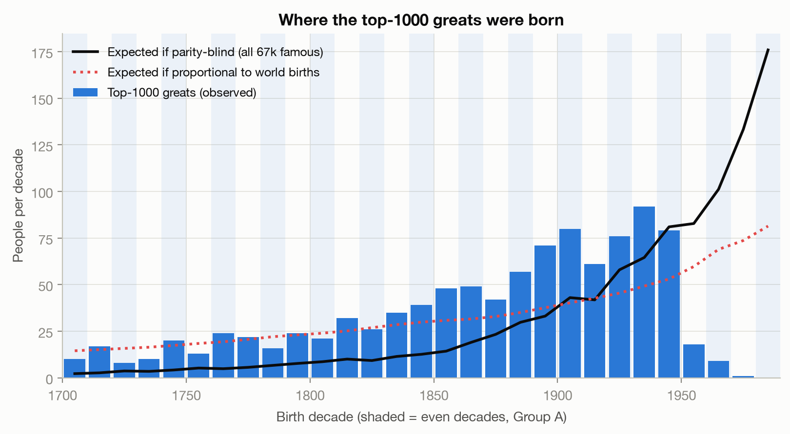
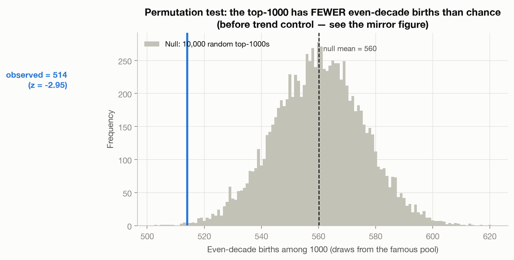
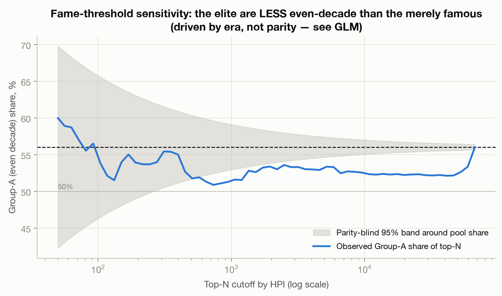
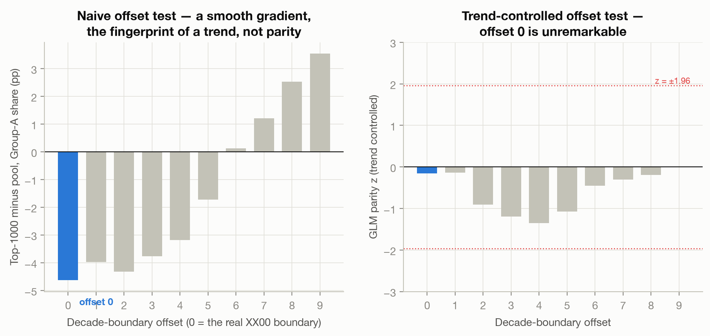
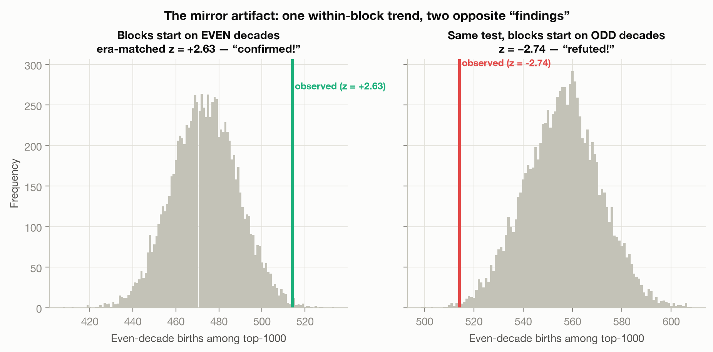
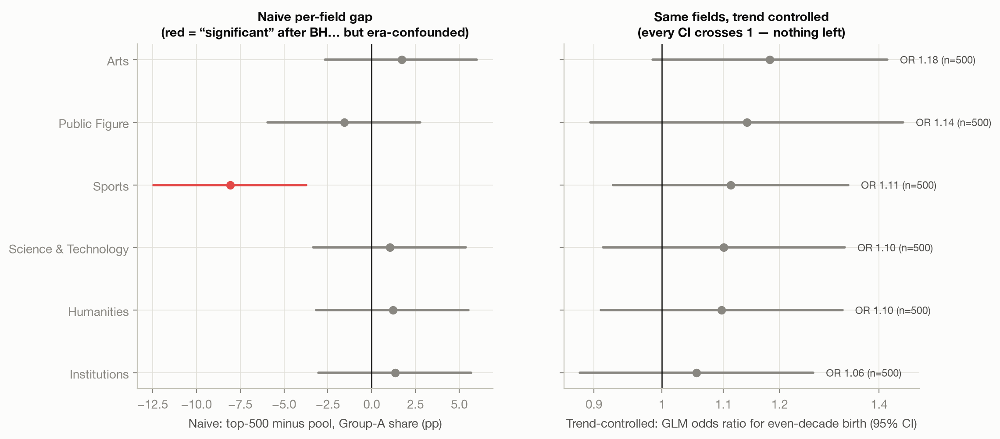
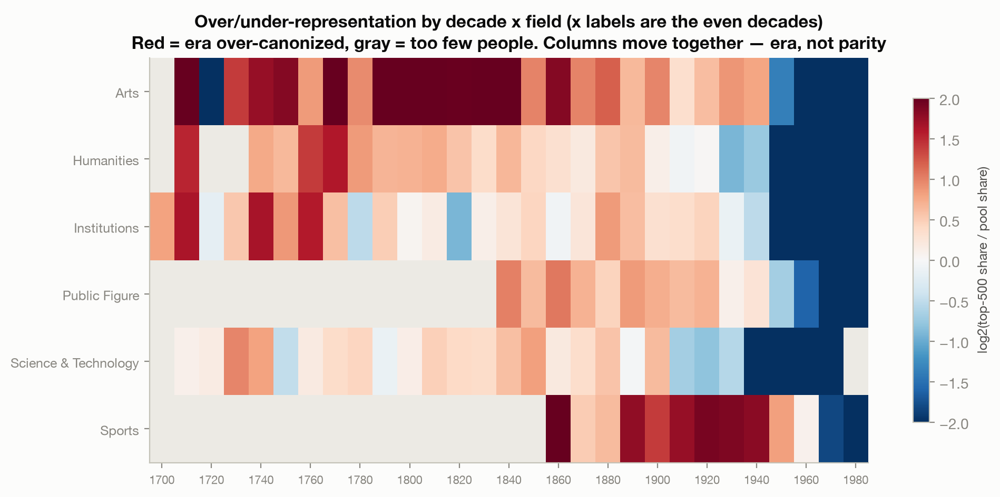
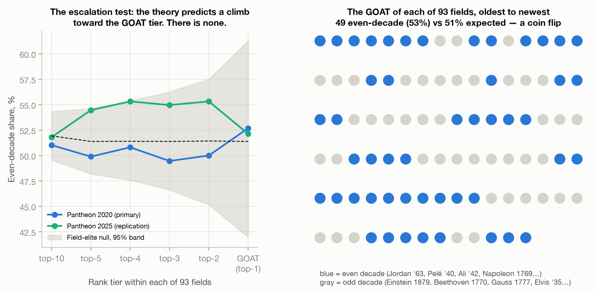
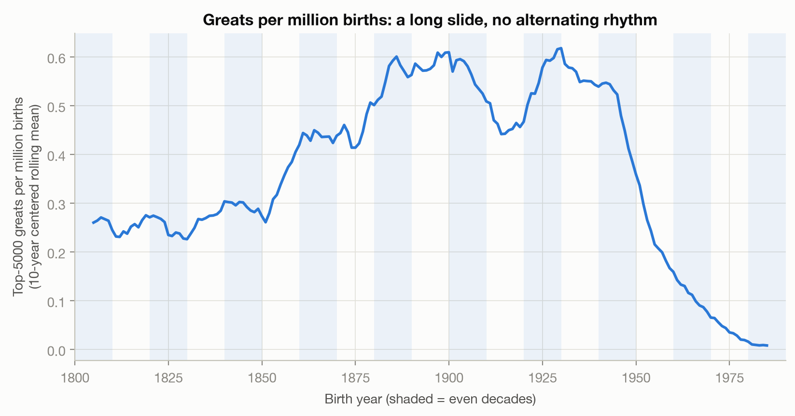

# The Even-Decade Theory: a pre-registered autopsy

**Hypothesis:** history's "greats" — the GOATs of every field — are disproportionately
born in *even decades*: birth years whose tens digit is even (1940s, 1960s, 1980s…).
Jordan 1963. LeBron 1984. Bolt 1986. Messi 1987. Pelé 1940. Napoleon 1769. Newton 1643.

**Verdict: refuted.** After controlling for *when* people were born, an even-decade
birth multiplies the odds of top-1000 all-time eminence by **0.99** (95% CI 0.87–1.12).
The null replicates in four datasets, all six domains, every half-century since 1700,
every fame threshold, all ten decade boundaries, and at the GOAT tier itself: the #1 of each of
93 fields splits **49 even / 44 odd**.

But the road there is the interesting part: the same dataset produced a *statistically
significant* result in **both directions** before it told the truth. This repo is as
much a case study in alternating-window artifacts as it is a test of the theory.

> Reproduce everything — raw downloads → statistics → all figures — with one command:
> `python run.py`. Every statistical draw is seeded; every number below reproduces exactly.

---

## Contents

1. [The design](#1-the-design)
2. [The data](#2-the-data)
3. [Act I — the naive test says the theory is *backwards*](#3-act-i--the-naive-test-says-the-theory-is-backwards)
4. [Act II — the era-matched test says it's *confirmed*](#4-act-ii--the-era-matched-test-says-its-confirmed)
5. [Act III — the referee: a trend-controlled GLM](#5-act-iii--the-referee-a-trend-controlled-glm)
6. [Replications](#6-replications)
7. [Per-field results](#7-per-field-results)
8. [The apex steelman: GOATs and the escalation curve](#8-the-apex-steelman-goats-and-the-escalation-curve)
9. [The ancients trap](#9-the-ancients-trap)
10. [Secondary analyses](#10-secondary-analyses)
11. [Scorecard](#11-scorecard)
12. [Repository layout & reproduction](#12-repository-layout--reproduction)
13. [Limitations](#13-limitations)

---

## 1. The design

Everything that could be gamed was locked **before any data was downloaded**, in
[`PREREGISTRATION.md`](PREREGISTRATION.md):

- **Groups.** Group A (even decades): years ending 00–09, 20–29, 40–49, 60–69, 80–89.
  Group B: the rest. Base rate ≈ half, so anecdotes are worthless — ~half of everyone
  you can name is a "hit."
- **Eligibility window.** Births 1700–1989. Pre-1700 excluded for record reliability
  (see [the ancients trap](#9-the-ancients-trap) — this exclusion turned out to
  *protect the theory from fake confirmation*, not from refutation). Post-1989
  excluded because those cohorts haven't had time to be canonized.
- **Primary test.** Pantheon top-1000 by HPI vs the full eligible famous population
  (internal baseline), exact binomial, one-sided *in the theory's favor*, α = 0.05.
- **The offset test (pre-registered kill-shot).** There are exactly 10 ways to cut
  years into alternating decade-parity groups (boundary at XX00, XX01, … XX09). A real
  decade effect must make offset 0 the extreme outlier of the 10. Anything that slides
  smoothly across offsets is a *trend*, not a parity effect.
- **Decision rule.** The theory survives only if (1) the primary test rejects in the
  predicted direction, (2) offset 0 is the most extreme of 10, and (3) the direction
  replicates in an independent fame metric.

Every post-hoc judgment call made after that is logged with timestamps and rationale in
[`DECISIONS.md`](DECISIONS.md) (D1–D10), including one arithmetic error in the
pre-registration itself (D6: the window holds 15 even but 14 odd decades) and which
analyses were added later and why (D7, D8, D10).

## 2. The data

| Dataset | Role | Eligible (born 1700–1989) | Fame metric | Source |
|---|---|---:|---|---|
| MIT Pantheon 2.0 (2020) | **primary** | 67,198 | HPI (Historical Popularity Index) | [pantheon.world](https://pantheon.world) |
| Pantheon 2025 update | replication | 91,441 | HPI | same bucket |
| Wikidata | replication | 5,126 | sitelinks (# of Wikipedia language editions ≥ 60) | SPARQL |
| Nobel laureates | sanity check | 990 laureate-prizes | none (whole list) | api.nobelprize.org (v1) |
| World births | baseline | 1600–2023 | — | OWID: UN WPP (1950+), HYDE population × CBR before |

Two baselines, because "vs 50/50" is wrong when births vary by decade:

1. **Internal (primary):** the full eligible famous population. Any documentation,
   notability, or birth-rate confound hits the top-1000 and the pool identically, so it
   cancels.
2. **Demographic:** world births per year. Against this baseline the naive top-1000 is
   null from the start: 51.4% observed vs 52.6% expected (p = 0.47).

Where the top-1000 actually sit in time, against both baselines:



*The top-1000 (bars) tracks neither the births-proportional expectation (red dotted)
nor the famous pool (black): canonization rises to a peak for ~1850–1950 cohorts, then
collapses for recent births. That trend — not decade parity — drives every naive
"effect" below.*

## 3. Act I — the naive test says the theory is *backwards*

Top-1000 by HPI: **514/1000 even-decade (51.4%)** vs pool share 56.0%.
One-sided (pro-theory) p = 0.999 — total failure. Two-sided p = **0.003**: the greats
are significantly *under*-represented in even decades. Permutation z = −2.95:



Sensitivity across fame cutoffs (vs pool 56.0%): top-100 = 54.0%, top-500 = 52.2%,
top-1000 = 51.4%, top-5000 = 53.3%. The "anti-even" gap holds in the 1800–1989 and
1500–1989 robustness windows too.



So… greatness *avoids* even decades? No. The pre-registered offset test catches the lie:



*Left: the naive "effect" slides smoothly across all ten possible
decade boundaries (−4.6pp at offset 0 rising to +3.5pp at offset 9). A genuine parity
effect would make offset 0 a discontinuous outlier; a smooth gradient is the fingerprint
of a birth-year* trend. *Right: after trend control (§5), no offset does anything.*

The trend: the top-1000's mean birth year is **1870**; the pool's is **1931**, because
the famous pool is stuffed with 1970s–80s-born athletes and actors who will never be
canonized. The 1980s is (a) the pool's largest decade — 11,823 people — and (b) even.
Era masquerading as parity.

## 4. Act II — the era-matched test says it's *confirmed*

Control for era, then: compare the top-1000 only against famous people born in the same
20-year block (each block = one even + one odd decade). Result: **z = +2.63,
p = 0.005**. Theory confirmed!

For about an hour. The blocks `[1700–1719, 1720–1739, …]` always put the even decade in
the *older* half — and canonization favors older births *within* blocks too. Shift every
block by exactly ten years (odd decade first) and the identical test yields
**z = −2.74**:



*One within-block trend, photographed from two angles. Two “significant” results at
±2.7σ from the same data under an arbitrary alignment choice are not two discoveries;
they are zero discoveries.* The mirror reproduces in the 2025 replication
(+3.36 / −2.07), confirming it's structural.

## 5. Act III — the referee: a trend-controlled GLM

Aggregate by birth year, then fit a binomial GLM:

```
logit P(in top-1000 | birth year) = poly(year, 5) + β · [even decade]
```

The polynomial absorbs the canonization trend at every scale; β can only pick up a
signal that *alternates decade-by-decade* — which is what the theory claims.

| Quantity | Value |
|---|---|
| β (parity) | −0.010 |
| **Odds ratio** | **0.990** |
| 95% CI | 0.872 – 1.123 |
| z | −0.16 |
| p (two-sided) | 0.87 |
| stability | z = −0.22 / −0.16 / −0.09 at poly degree 3 / 5 / 8 |
| offset test, trend-controlled | offset 0 ranks 3/10; no offset reaches \|z\| = 1.4 |

With n = 67,198, the confidence interval rules out any effect larger than about
±13%. The point estimate is −1%.

## 6. Replications

| Dataset | Trend-controlled OR (95% CI) | z | Verdict |
|---|---|---|---|
| Pantheon 2020 (primary) | 0.99 (0.87–1.12) | −0.16 | null |
| Pantheon 2025 | 1.04 (0.92–1.18) | +0.59 | null |
| Wikidata sitelinks | 1.06 (0.92–1.22) | +0.82 | null |
| Nobel laureates (vs births baseline) | 52.4% vs 53.4% expected | — | p = 0.55, null |

No Nobel category deviates either: chemistry 50.5%, economics 49.5%, literature 49.2%,
medicine 53.0%, peace 57.3%, physics 54.1% (all p ≥ 0.36, n per category 99–232).

## 7. Per-field results

The naive per-field numbers contain a beautiful cautionary tale: **Sports** shows a
−8.1pp gap, BH-significant — "top athletes avoid even decades!" It's the era artifact
in miniature (sports fame concentrates in recent even-heavy decades; all-time greats
skew earlier). Trend-controlled, it evaporates — and every domain's CI crosses 1:

| Domain | Naive gap (top-500 − pool) | Trend-controlled OR (95% CI) |
|---|---:|---|
| Arts | +1.7pp | 1.18 (0.99–1.42) |
| Public Figure | −1.6pp | 1.14 (0.90–1.45) |
| Sports | **−8.1pp (BH-sig!)** | 1.11 (0.93–1.33) |
| Science & Technology | +1.0pp | 1.10 (0.91–1.33) |
| Humanities | +1.2pp | 1.10 (0.91–1.32) |
| Institutions | +1.3pp | 1.06 (0.88–1.26) |



Why the naive numbers wobble — whole decade-columns move together across every field
(eras get over/under-canonized wholesale); nothing alternates:



## 8. The apex steelman: GOATs and the escalation curve

The strongest fair objection: *the theory was never about top-1000 populations — it's
about the #1 of each field, and it should intensify toward the top.* Tested, with the
design tilted pro-theory ([`DECISIONS.md`](DECISIONS.md) D10, [`src/apex.py`](src/apex.py)):

- **GOAT test.** The single highest-HPI person in each of 93 occupations — selected by
  the data, zero human curation ([`output/goat_list.csv`](output/goat_list.csv)).
  Result: **49/93 even-decade (52.7%)** vs 51.4% expected from a within-field-elite
  null. z = +0.27, p = 0.44.
- **Escalation curve.** Even-decade share at tiers top-10 → 5 → 4 → 3 → 2 → 1
  (2020 primary): 51.0% → 49.9% → 50.8% → 49.5% → 50.0% → 52.7%. Flat. The null here
  draws each field's tier from that same field's top-10/20, so era cancels *by
  construction* (Jordan is compared to LeBron and Kareem, never to Kant).
- **Disclosure.** In the 2025 replication, the top-4 tier grazes p = 0.046 — 1 of 12
  uncorrected tier tests (≈1 expected by chance), absent in the primary data, and it
  *fades at top-1* where the theory needs it to peak.



The hits are real: Jordan '63, Pelé '40, Ali '42, Napoleon 1769, Darwin 1809, Edison
1847, Spielberg '46, Marley '45, Kant 1724. The unremembered misses sit at the same
rank: Einstein 1879, Beethoven 1770, Gauss 1777, Turing 1912, Elvis 1935, van Gogh
1853, Freud 1856, Gates 1955, Borg 1956. (Beethoven and Mozart — the #1 and #3 most
eminent humans in the whole dataset — are both odd-decade.)

## 9. The ancients trap

Extending to antiquity (Newton 1643, the great religious teachers) requires a check
that turned out to matter enormously — **estimated ancient birth years are rounded to
round numbers, and a year ending in 0 always lands in an even decade**:

| Birth era | n | years ending in 0 | even-decade share |
|---|---:|---:|---:|
| 800 BCE – 500 CE | 2,756 | **59.9%** | 57.9% |
| 500 – 1200 | 2,910 | 38.1% | 52.8% |
| 1200 – 1500 | 2,388 | 25.1% | 49.4% |
| 1500 – 1700 | 2,799 | 13.8% | 51.1% |
| 1700 – 1989 | 66,050 | 9.4% | 55.3%* |

*\*inflated by the 15-even/14-odd window imbalance (D6), which the internal baseline
absorbs.*

Ancient data mechanically fakes evidence **for** the theory, regardless of truth. Taking
the recorded years at face value the apex ancients still coin-flip (Muhammad 570,
Aristotle, Plato — odd; Confucius, Luther — even), but most ancient birth years (Moses,
Abraham, the Buddha, Jesus) are tradition or scholarly estimates, so antiquity cannot
testify either way.

## 10. Secondary analyses

All pre-registered, all in [`output/results.json`](output/results.json):

- **Bayesian.** Beta(1,1)-binomial posterior: P(top-1000 over-represented vs internal
  baseline) = 0.002; the *direction* claim is dead both ways once trend-controlled.
- **Fame-weighted.** HPI-weighting the entire population shifts the even share by
  −1.4pp (bootstrap CI −1.5 to −1.3) — the era artifact again; gone under trend control.
- **Temporal stability.** Within every birth half-century the top-1000 tracks its era's
  pool share with small, sign-alternating gaps (1700–49: 58.5% vs 62.2%; 1750–99: 40.4%
  vs 38.4%; 1800–49: 56.2% vs 58.7%; 1850–99: 39.7% vs 40.8%; 1900–49: 60.6% vs 63.1%).
  No era shows a consistent parity effect.
- **Greats-per-birth over time** — long waves, no alternating rhythm:



## 11. Scorecard

| Where the theory could have shown up | Result |
|---|---|
| Top-1000 of humanity, trend-controlled | OR 0.99 (0.87–1.12) — null |
| All 10 decade boundaries (offset test) | offset 0 unremarkable after trend control |
| Six domains, sports → science | every CI crosses 1 |
| Every fame cutoff (top-100 → top-50,000) | no pro-even signal |
| Every birth half-century, 1700–1989 | tracks baseline |
| 990 Nobel laureates, 6 categories | 52.4% vs 53.4% expected |
| The #1 GOAT of 93 fields | 49 even / 44 odd |
| Escalation top-10 → top-1 | flat |
| Fame-intensity weighting | artifact only |
| Independent metrics (HPI 2020, HPI 2025, sitelinks) | 0.99 / 1.04 / 1.06 |

**Pre-registered decision rule: 0 of 3 conditions met. Refuted.**

What *is* real: an **era effect**. Greatness per birth cohort moves in long waves
(fig 6, fig 8), some legendary clusters happen to sit in even decades (the 1940s, the
1980s football generation), and memory keeps the hits while dropping Einstein, Ruth,
Kobe, and Brady. Base-rate neglect does the rest — half of everyone is a "hit."

## 12. Repository layout & reproduction

```
├── PREREGISTRATION.md      # hypotheses, tests, decision rule — locked before any data
├── PLAN.md                 # pipeline design
├── DECISIONS.md            # every judgment call, D1–D10, including disclosed errors
├── run.py                  # one command: fetch → clean → analyze → figures
├── src/
│   ├── fetch_pantheon.py   # Pantheon 2020 + 2025 person datasets (cached)
│   ├── fetch_occupations.py# occupation → domain mapping (api.pantheon.world)
│   ├── fetch_wikidata.py   # SPARQL, humans with ≥60 sitelinks, chunked by decade
│   ├── fetch_nobel.py      # Nobel API v1 bulk endpoint
│   ├── fetch_baseline.py   # OWID births + population
│   ├── clean.py            # dedupe, eligibility, parity flags → parquet
│   ├── analysis.py         # the full battery (offset, permutation, era-matched,
│   │                       #   GLM, per-field+BH, Bayesian, weighted, temporal)
│   ├── apex.py             # GOAT test, escalation curve, ancients artifact
│   ├── figures.py          # figures 1–8 (PNG + SVG)
│   └── fig_apex.py         # figure 9
├── data/
│   ├── raw/                # ~85 MB of downloads — gitignored, re-fetched by run.py
│   └── processed/          # committed parquets (~9 MB) so analysis runs offline
├── output/
│   ├── results.json        # every statistic cited anywhere
│   ├── apex_results.json   # GOAT/escalation/ancients numbers
│   ├── goat_list.csv       # the 93 field GOATs with birth years and parity
│   ├── REPORT.md           # full academic-style write-up
│   └── blog_post.md        # narrative version + X thread
└── figures/                # all charts, PNG + SVG
```

```bash
python3 -m venv .venv
.venv/bin/pip install pandas numpy scipy matplotlib requests pyarrow
.venv/bin/python run.py          # full pipeline (downloads ~85 MB once, then offline)
```

Skip the downloads: the committed parquets let you run
`.venv/bin/python src/analysis.py && .venv/bin/python src/figures.py` directly.
Seeds are fixed (42), so all numbers reproduce bit-for-bit.

## 13. Limitations

- **Fame ≠ greatness.** HPI and sitelinks measure Wikipedia-mediated memory, which is
  Western- and recency-skewed. But a parity *law* must show up in any reasonable
  eminence metric; it shows up in none of three.
- The pre-1950 births baseline approximates births as population × slowly-varying crude
  birth rate; it only affects the demographic-baseline tests, and parity contrasts are
  insensitive to smooth baseline error.
- The Wikidata replication is smaller than pre-registered (5,126 vs 15k–25k target; D9).
- The era-matched test and GLM were added after first results (D7, D8) — disclosed, and
  direction-symmetric: each could have rescued the theory exactly as easily as buried
  it. The pre-registered tests alone already refute.
- Nothing here speaks to post-1989 cohorts. The null's prediction: they'll coin-flip too.
